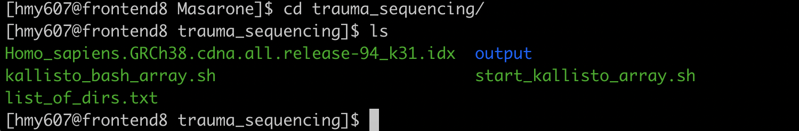

## How to efficiently run kallisto on Apocrita

[Sara Masarone](https://www.turing.ac.uk/people/doctoral-students/sara-masarone)   [s.masarone@qmul.ac.uk](mailto:s.masarone@qmul.ac.uk)   [smasarone@turing.ac.uk](mailto:smasarone@turing.ac.uk)


This documentation shows how to quantify abundances of transcripts from bulk and single-cell RNA-Seq data using [kallisto](https://pachterlab.github.io/kallisto/starting) on Apocrita (QMUL cluster).

The first step is to log into [Apocrita](https://docs.hpc.qmul.ac.uk) and navigate to the folder where you would like to get the output files from `kallisto`. I would recommend to work in a dedicated directory created just for this analysis, possibly not the same directory where the sample files are stored. In this case we will call this directory `sequencing`.

You can create a new directory with
`mkdir [name_of_new_directory]`

Once we are in our working directory, we can start preparing what we need for the analysis.
Since kallisto is not preinstalled on Apocrita, we need to create an environment where we can install it for subsequent use.

You can type these lines to generate and activate an environment:
```{bash}
module load anaconda3
conda create --name myenv  #("my_env" should be changed with the name you choose for your environment)
conda activate myenv       #This will activate your environment
conda install kallisto     #This will install kallisto in your environment
```

Now we have created our own environment where kallisto is installed. This will be used later in our scripts.
For more info about anaconda click [here](https://docs.conda.io/projects/conda/en/latest/user-guide/tasks/manage-environments.html).

Before getting into the details of the script we need to have a look at the folders tree to know where the data is located. In our case the data is found into this folder   `/data/WHRI-Bioinformatics/globus/MRC_Trauma/X204SC20031847-Z01-F001-Data/raw_data`. This folder, in turn, contains one folder for each sample (in our case it contains 459 folders as we have 459 samples) named with the patient ID (S1000, S1009, etc).
Each sample folder is named after the patient ID and contains two fastq.gz files (read_1,read_2)


## [ARRAY JOBS](https://docs.hpc.qmul.ac.uk/using/arrays/)  
We will use an array job as they are very useful when repeating the same analysis over many samples.

In order to run kallisto on Apocrita, we need to write a bash script where we request a certain amount of RAM, cores, run time and threads. Array jobs allow to run the same job a large number of times with different input parameters. Whilst this could be done by submitting lots of individual jobs, a more efficient and robust way is to use an array job. This makes kallisto fast and efficient.

### What we need to run kallisto
Your data, two scripts and an index are required to run kallisto. Except the data, that can be in any directory,the rest should be present in the `sequencing` directory.
> 1) A script (we) called start_kallisto_array.sh is required to submit the job

> 2) A script (we) called kallisto_bash_array.sh is required to run kallisto

> 3) And a transcriptome [index](https://github.com/pachterlab/kallisto-transcriptome-indices)


## Job script
In this script called `start_kallisto_array.sh` we are requesting 1 core, 12h runtime, 32GB and 459 threads (the number of threads corresponds to the number of samples you have - in this case we have 459 samples). After specifing what requirements we have, we load the module `anaconda3` and we activate the environment previously made (in this case the enviroenment is called `kallisto_env`).
We then list the folders present in our directory, we group the ones that start with S (we only want to use the folders that contain samples -they all start with S) and we assign the folders' names to a file called `list_of dirs.txt`.
We then create a variable called `INPUT_DIR` that will be used to loop through the folders that contain the data.
Last we will call the real script that  will run kallisto.

```{bash}
#!/bin/sh
#$ -cwd            # Set the working directory for the job to the current directory
#$ -pe smp 1       # Request cores
#$ -l h_rt=12:0:0  # Request hour runtime
#$ -l h_vmem=32G   # Request GB RAM
#$ -t 1-459

module load anaconda3
conda activate kallisto_env

ls -1 /data/WHRI-Bioinformatics/globus/MRC_Trauma/X204SC20031847-Z01-F001-Data/raw_data | grep 'S' > list_of_dirs.txt

INPUT_DIR=$(sed -n "${SGE_TASK_ID}p" list_of_dirs.txt)
./kallisto_bash_array.sh $INPUT_DIR  #run the script
```

## Script to quantify abundance
Once created the previous script, we can work on the script (`kallisto_bash_array.sh`) that quantifies abundance.

```{bash}
#!/bin/bash

my_DIR="/data/WHRI-Bioinformatics/globus/MRC_Trauma/X204SC20031847-Z01-F001-Data/raw_data/"

kallisto quant -i *.idx -o "output/$1" $(ls $my_DIR$1/*.gz)
```

Let's now save both scripts in our current directory.
Within our current directory, let's create a subdirectory called `output` where kallisto will download all the results.
You should now find yourself in a directory only containing an index, two scripts and one `output` directory

To create the "output" directory:

```{bash}
mkdir output
```
Before running the script your folder should look like this (please ignore the `list_of_dirs.txt` file, it will be created automatically by `kallisto`)



Last, to run our scripts and submit the job:
```{bash}
qsub start_kallisto_array.sh
```
You can monitor your job using:
```{bash}
qstat
```
If you see that your job is pending (qw) you can type:
```{bash}
showqueue
```
Once the job is finished (and all the individual jobs are completed), check that the inputs (initial number of samples) and the outputs (new folders created in the `output` directory) match

More info on monitoring jobs [here](https://docs.hpc.qmul.ac.uk/using/monitoringjobs/)

